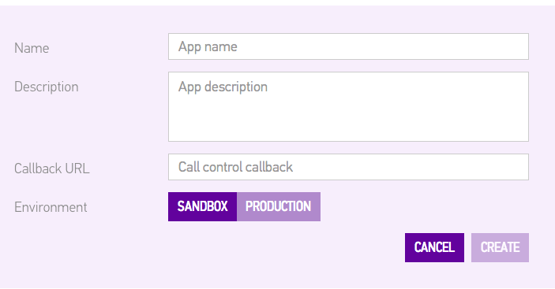

#Send an SMS in Java

This tutorial will walk you through building a simple Java SMS project that uses Sinch to send an SMS. You can find the finished project on our GitHub at [github.com/sinch/java-sms-tutorial](http://www.github.com/sinch/java-sms-tutorial).

##Setup

If you don't yet have a Sinch developer account, create one at [sinch.com/signup](https://www.sinch.com/dashboard/#/signup). Use the developer dashboard to create an app (you only need to input an app name), and take note of the app key and secret. 

##Library for Base64 encoding

You will need to download and add the commons codec library to your Eclipse project to encode your app key and secret. You can do so [here](http://commons.apache.org/proper/commons-codec/download_codec.cgi). In your project, create a **libs** folder at the same level as **src**, and move **commons-codec-1.10.jar** to this folder. Then, right-click the .jar file and click **build path --> add to build path**

##Send an SMS

Start by creating a new class; I'll name mine **Sms.java**. To keep things simple, I put the code to send an SMS in the **main** function. To make this work for you, substitute a phone number (in [E.164 format](http://en.wikipedia.org/wiki/E.164)) to which to send the message, your app key, and your app secret. 

	import java.io.BufferedReader;
	import java.io.IOException;
	import java.io.InputStreamReader;
	import java.io.OutputStream;
	import java.net.HttpURLConnection;
	import java.net.URL;
	import org.apache.commons.codec.binary.Base64;
	
	public class Sms {
	
		public static void main(String[] args) {
			
			try {
				String phoneNumber = "phone-number";
				String appKey = "your-app-key";
				String appSecret = "your-app-secret";
				String message = "Hello, world!";
				
		        URL url = new URL("https://messagingapi.sinch.com/v1/sms/" + phoneNumber);
		        HttpURLConnection connection = (HttpURLConnection) url.openConnection();
		        connection.setDoOutput(true);
		        connection.setRequestMethod("POST");
		        connection.setRequestProperty("Content-Type", "application/json");
		        
		        String userCredentials = "application\\" + appKey + ":" + appSecret;
		        byte[] encoded = Base64.encodeBase64(userCredentials.getBytes());
		        String basicAuth = "Basic " + new String(encoded);
		        connection.setRequestProperty("Authorization", basicAuth);
		        
		        String postData = "{\"Message\":\"" + message + "\"}";
		        OutputStream os = connection.getOutputStream();
		        os.write(postData.getBytes());
		        
		        StringBuilder response = new StringBuilder();
		        BufferedReader br = new BufferedReader(new InputStreamReader(connection.getInputStream()));
		        
		        String line;
		        while ( (line = br.readLine()) != null)
		            response.append(line);
		        
		        br.close();
		        os.close();
		        
		        System.out.println(response.toString());
		
		    } catch (IOException e) {
		        e.printStackTrace();
		    }
			
		}
	
	}
	
Now run the project and you will see "Hello, world!" appear as an SMS to the phone number you entered. That's how easy is it to send Java SMS with Sinch.

**Note about sending quotes in your message**: If you want to send a message like **Jordan says "hi,"** you will need to put three backslashes before the quotes that you want to show up in the message.

In addition, you can find SMS prices by country here: [sinch.com/pricing/sms-prices](https://www.sinch.com/pricing/sms-prices/).
